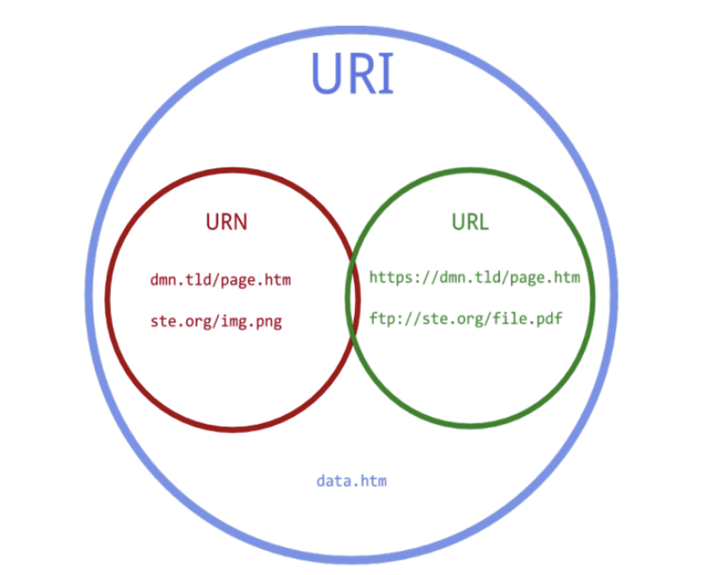

# API와 JSON

### HTTP란?

- HTTP
    - “클라이언트와 서버가 서로 통신하는 방법을 표준화하는 TCP/IP 기반 애플리케이션 계층 통신 프로토콜 “
    - **인터넷에서 데이터를 주고받기 위해 사용되는 프로토콜**
- 프로토콜
    - 컴퓨터 내부에서, 또는 컴퓨터 사이에서 데이터의 교환 방식을 정의하는 **규칙** 체계
- HTTP 와 HTTPS 의 차이
    
    
    |  | HTTP | HTTPS |
    | --- | --- | --- |
    | 암호화 | X | O |
    | 포트 번호 | 80 | 443 |
    | 보안 레벨 | 낮음 | 높음 |

### HTTP 주요 요소와 작동원리



- URI(Uniform Resource Identifier)
    - 통합 자원 식별자
    - 인터넷에 있는 자원 위치 알기 위해 **자원 자체를 식별**하는 방법
    - Uniform: 리소스 식별하는 통일된 방식
    - Resource: 자원, URI로 식별 가능한 모든 것
        - 자원: 웹 브라우저 파일 포함 우리가 구분할 수 있는 모든 것
    - Identifier: 다른 항목의 구분에 필요한 정보
    - 인터넷에서 요구되는 기본 조건
    - 인터넷 프로토콜에 항상 붙어 다님

- URL(Uniform Resource Locator)
    - 파일식별자
    - 네트워크 상에서 **자원의 위치**를 알려주기 위한 규약
    - 컴퓨터 네트워크와 검색 메커니즘에서의 위치를 지정하는, 웹 리소스에 대한 참조
    - 웹사이트 주소뿐만 아니라 컴퓨터 네트워크상의 자원을 모두 내는 표기법
    - 특정 주소에 접속하려면 URL에 맞는 프로토콜을 알고 동일한 것으로 접속해야 함
- BaseURL
    
    
    


- 엔드포인트(EndPoint)란?
    - 컴퓨터 네트워크에 연결하고 컴퓨터 네트워크와 정보를 교환하는 물리적 디바이스
    
    **→ 컴퓨터 네트워크에 연결되는 모든 장치**
    
    - 엔드포인트 관리
        - 네트워크에 연결되는 엔드포인트를 모니터링
        - 인증된 엔드포인트만 액세스할 수 있도록 함
        - 엔드포인트 보호
        - 엔드포인트에 설치된 소프트웨어 관릴

- HTTP 요청과 응답 방식
    - 헤더와 바디
    - HTTP Status Code ( 200, 201, 400, 404, 500 … )
    - HTTP Method ( GET, PUT, POST, PATCH, DELETE) 의 역할과 사용 방식
    

---

### API란?

- Application Programming Interface: 응용 프로그래밍 인터페이스
- 응용프로그램에서 사용할 수 있도록, 운영체제나 프로그래밍 언어가 제공하는 기능을 제어할 수 있게 만든 인터페이스


- 손님:  메뉴에 있는 음식 요청하는 프로그램
- 셰프: 요리 만들어 전달하는 운영체제
- 종업원: API
- 메뉴: API의 인터페이스
    - 인터페이스: 서로 다른 두 개의 시스템, 장치 사이에서 정보나 신호 주고받는 경계면
    - 사용자가 기기를 쉽게 동작시키도록 도움 주는 시스템

### REST API란?

- REST: Representational State Transfer
- 자원을 이름으로 구분하여 해당 자원의 상태를 주고받는 모든 것
- HTTP URI를 통해 자원 명시, HTTP method 통해 해당 자원(URI)에 대한 CRUD Operation 적용
    - CRUD: 대부분의 컴퓨터 소프트웨어가 가지는 기본적인 데이터 처리 기능인 Create(생성), Read(읽기), Update(갱신), Delete(삭제)
    - REST에서의 CRUD Operation
    - Create : 데이터 생성(POST)
    - Read : 데이터 조회(GET)
    - Update : 데이터 수정(PUT, PATCH)
    - Delete : 데이터 삭제(DELETE)
- REST 구성요소
    - 자원 : URI로 자원을 표현해야 함
    - 행위 : 자원에 대한 행위는 HTTP Method로 표현되어야 함
    - 표현 : 응답 자원의 상태를 JSON, XML 등의 형태로 나타내야 함
- REST의 장단점
    - 장점
        - 가독성 good (REST API 메시지를 읽는 것만으로도 의도하는 바 파악 가능)
        - HTTP 인프라 그대로 사용 → 별도의 인프라 구축 필요X
        - 독립적 진행 → 이전에 진행된 내용 클라이언트가 알 필요 X (해당 URI와 원하는 메소드만 이해하면 됨)
        - JSON, XML 등 다양한 언어로 작성 가능
        - 쉽고 빠른 개발, 배포 가능
    - 단점
        - HTTP 메소드 사용 → 메소드 형태 제한적
        - 표준의 부재 (가이드 X)

---

### HTTP와 REST API의 관계성

- HTTP 메서드
    - **GET**: 서버로 부터 데이터를 취득
    - **POST**: 서버에 데이터를 추가, 작성 등
    - **PUT**: 서버의 데이터를 갱신, 작성 등
    - **DELETE**: 서버의 데이터를 삭제
    - HEAD: 서버 리소스의 헤더(메타 데이터의 취득)
    - OPTIONS: 리소스가 지원하고 있는 메소드의 취득
    - PATCH: 리소스의 일부분을 수정
    - CONNECT: 프록시 동작의 터널 접속을 변경
    
- REST API설계에서 HTTP 메서드 활용
    
    
    
- RESTful 하게 API 설계하는 방법
    - URI는 정보의 자원을 표현해야 한다.
        - **리소스명은 동사보다는 명사를 사용**
        - 복수 명사 사용
        - 슬래시 구분자(/)는 계층 관계 나타내는 데 사용
        - 마지막 문자로 슬래시 포함 X
        - 밑줄 대신 하이픈 사용
        - 소문자 사용
        - 파일 확장자 포함시키지 않기
    - 자원에 대한 행위는 HTTP Method(GET, POST, PUT, DELETE)로 표현한다.

- 둘의 관계성이 어떻게 되는지 말해주세요!
    - REST는 소프트웨어 아키텍처(설계 지침, 원리 등)
    - REST에서 클라이언트-서버 간 통신 시 HTTP 사용한 것
    - REST는 HTTP 사용하는 것이 일반적(거의 필수)

---

### XML과 JSON 이란 ?

- XML(EXtensible Markup Language)
    - 데이터 저장, 전달 목적으로 만들어짐
    - 저장되는 데이터의 구조를 기술하기 위한 언어
    - 서로 호환되지 않는 데이터 타입을 사용 시 시스템 간의 데이터 교환에 많은 시간, 노력 발생 (+ 데이터 손실)
    - XML은 텍스트 형식으로 저장 → 소프트웨어, 하드웨어로부터 독립적인 데이터 저장, 전달 가능
    - **새로운 운영체제, 프로그램, 브라우저 등과 무관하게 데이터 안전하고 손쉬운 전달 가능**
    
- XML의 기본 구조 및 태그 사용방식
    - **첫 줄에 <xml>태그 사용하여 XML 문서임을 명시해야 함**
        - version: XML 문서에 사용된 XML의 버전
        - encoding: XML 문서의 문자셋(character set)명시
            - 기본값은 UTF-8
        - standalone: XML 문서가 외부 DTD(Document Type Definition)와 같은 외부 소스의 데이터에 의존하고 있는 문서인지 XML 파서(parser)에 알려주는 역할
            - 기본값 no
            - yes: ‘이 문서를 파싱할 때 참조해야 할 외부 소스가 없다’
    
    ```html
    <?xml version="XML문서버전" encoding="문자셋" standalone="yes|no"?>
    
    <?xml version="1.0" encoding="UTF-8"?>
    ```
    
    - 루트 요소 생성
        - XML 문서에 존재하는 모든 요소의 조상 요소가 됨
        
    - 모든 XML 요소는 종료 태그를 가져야 함
    - XML 태그는 **대소문자 구분 (HTML은 X)**
    - 태그 여닫는 순서 지키기
    - 속성값 따옴표로 감싸기
    - 띄어쓰기 인식 (HTML은 X)

- XML의 특징과 장점
    - 다른 목적의 마크업 언어를 만드는 데 사용되는 다목적 마크업 언어
    - 다른 시스템끼리 다양한 종류의 데이터를 손쉽게 교환할 수 있도록 해줌
    - 새로운 태그를 만들어 추가해도 계쏙해서 동작함 → 확장성 good
    - 데이터를 보여주지 않고, 전달과 저장만을 목적으로 함
    - 텍스트 데이터 형식의 언어
    - 모든 XML 문서는 유니코드 문자로만 이루어짐

- JSON의 기본 구조 및 표현 방식
    - JSON: JavaScript Object Notation
    - 좀 더 쉽게 데이터 교환, 저장하기 위해 만들어진 텍스트 기반의 데이터 교환 표준
        - XML의 대안
    - 텍스트 기반 → 어떤 프로그래밍 언어에서도 읽고 사용 가능
    - 이름과 값의 쌍으로 이루어짐
        - 데이터 이름, 콜론(:), 값의 순서로 구성
    - 쉼표(,)로 나열됨
    - 객체(object)는 중괄호({})로 둘러쌓아 표현
    - 배열(array)은 대괄호([])로 둘러쌓아 표현
- JSON의 특징과 장점
    - 자바스크립트 확장하여 만들어짐
    - 자바스크립트 객체 표기법 따름
    - 사람과 기계 모두 읽기 편하도록 고안됨
    - 프로그래밍 언어와 운영체제에 독립적
    - XML과 달리 문자열 전송받은 후에 해당 문자열 바로 파싱
        - XML보다 더 빠른 처리 속도
        - HTML과 자바스크립트 연동됨 → 빠른 응답 필요한 웹 환경에서 많이 사용됨

- REST API 에서는 어떤걸 기준으로 사용할까요?
    - JSON이 자바스크립트와 호환성이 뛰어나고 더 빠르기 때문에 XML보다 많이 사용될 것 같다