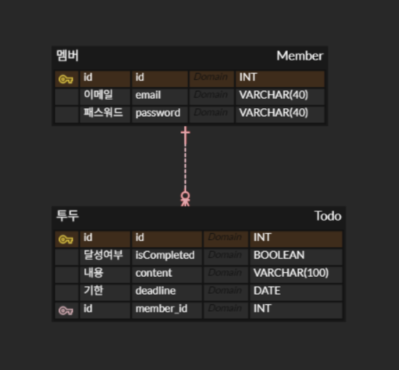

# week7

## 과제(1)

Domain 에 있는 2개의 테이블을 보고 노트에 혹은 프로그램(ERDcloud)을 이용하여 테이블의 컬럼값. 매핑관계(1:1 or 1:N ) 를 그려보세요.

**Primary key(pk) 기본키**

- 개체 식별하는 고유값
- 모든 테이블에 필수적으로 존재

**Foreign key(fk) 외래키**

- 레이블 간의 관계
- 한 테이블의 외래키는 연결되어 있는 다른 테이블의 기본키 중 하나



하나의 `Member`는 여러 개의 `Todo`를 가질 수 있음.

하나의 `Todo`는 하나의 `Member`에 소속됨.

⇒ **일대다 관계**

## 과제(2)

안드로이드 혹은 웹 의 디자인을 보고, Swagger의 API 가 각 디자인 화면에서 어떤 url이 사용될지 생각해보세요. 

[회원 가입] → *POST*


```bash
POST : /api/members/signup

{
  "email": "test@inu.ac.kr",
  "password": "pwd432!"
}
```

[로그인] → *POST* → 로그인


```bash
POST : /api/members/login

{
  "email": "test@inu.ac.kr",
  "password": "pwd432!"
}
```

### **왜 `POST`를 사용하는가?**

- 서버에 **데이터를 전송**하여 **새로운 자원을 생성 혹은 업데이트**
    - **새로 만드는 요청**과 **불러오는 요청**을 모두 처리 가능
- **회원가입**에서는 **새로운 자원**(사용자)을 서버에 **생성**하는 것이므로 `POST`를 사용
- **로그인**에서는 **기존 자원**(사용자)을 **인증**하는 것이므로 `POST`를 사용
    - `GET` 대신 `POST`를 사용하는 이유?
        - 비밀번호와 같은 민감한 정보를 **본문에 담아서** 보내기 때문
        - `GET`은 URL에 데이터를 포함시키기 때문에 보안상 좋지 않음

***(HTTP 메서드가 같더라도, URL 경로로 구분 가능)***

[☑️] → *PATCH* → todo 상태: 완료


```bash
PATCH : /api/todos/{todoId}/complete

{
  "status": "completed"
}
```

[Add Task] → *POST* → todo 등록(내용, 날짜)

```bash
POST : /api/todos

{
  "task": "내용",
  "dueDate": "2024-11-16",
}
```

[✏️] → *PATCH* → todo 수정

```bash
PATCH : /api/todos/{todoId}

{
  "task": "수정내용",
  "dueDate": "2024-11-16"
}
```

[🗑️] → *DELETE* → todo 삭제

```bash
DELETE : /api/todos/{todoId}
```