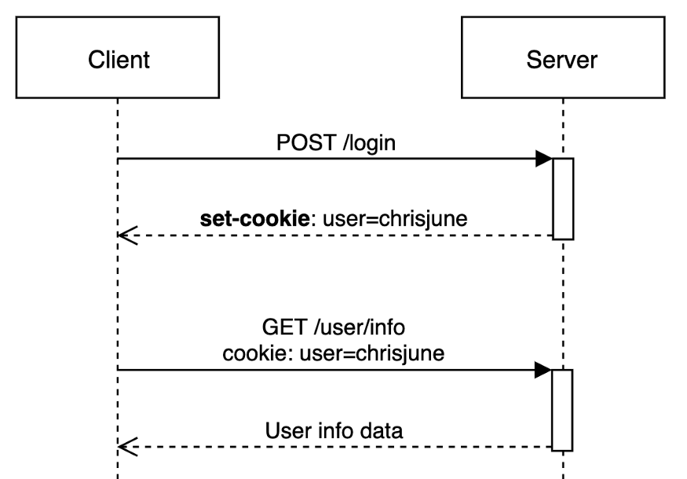

# week8


### 배경

1. HTTP의 비연결성
    - 요청-응답 주고받은 뒤 연결을 끊는다
        - 매번 새로 연결 맺음
2. HTTP의 비상태성
    - 요청-응답 교환하는 동안 상태를 저장하지 않는다
        - 이전 것 기억 못함(무관)
3. 장점
    - 오버헤드(시간, 메모리 등 자원) 감소
    - 빠르고 확실한 데이터 처리
    - 확장성(상태 공유하지 않으므로)
4. 단점
    - **웹 발전 ⇒ 상태 유지 필요해짐**
        - 매번 새로 로그인…

### 쿠키

- 클라이언트(브라우저)에 저장됨
- Key와 Value 값으로 이뤄짐
    - 단순한 문자열 저장
- 서버 통신 시 헤더에 담겨 전송됨
    - 서버, 응답 시 헤더에 키 값 실어 전송
    - → 브라우저, 쿠키 저장
    - → 다음 요청부터 자동으로 쿠키 송신

**쿠키 동작 방식**

1. 클라이언트에서 HTTP Request로 페이지를 요청
2. 서버는 HTTP Response에 Set-Cookie를 포함시켜 응답
3. 통신
4. 클라이언트에서 추가로 요청을 할 경우 HTTP Request와 Cookie를 서버에 보낸다.
5. 서버는 쿠키의 이전 상태 정보를 읽어 쿠키를 업데이트 후 변경된 쿠키를 HTTP Response로 응답



**⇒ HTTP의 비상태성 보완**

### 단점

- 요청마다 쿠키 송신
    - 오버헤드 방지를 위해 브라우저마다 쿠키 데이터 제한 有
- 노출, 조작 위험 有

### 세션

- 정보를 서버측에 저장하는 방식
- 브라우저로 웹서버에 접속~종료까지를 하나의 상태로 보고, 그 상태를 일정하게 유지하는 기술
- 서버, 클라이언트 구분 위해 세션 ID 부여
- 접속 시간 제한
    - 일정 시간 응답 無 → 정보 유지 X
- 사용자 ⬆️ ⇒ 서버 메모리 차지 ⬆️
- 일정 시간이 지나면 자동 만료
    - 만료 시간 지정 X → 계속해서 사용 가능(보안 위험)

**세션 동작 방식**

1. 클라이언트, 페이지 요청(사용자 로그인)
2. 서버, 접근한 클라이언트의 쿠키 확인 → 클라이언트가 해당 session-id를 보냈는지 확인
    1. session-id가 없다면 서버는 session-id를 생성 후 클라이언트에 전달
3. 클라이언트, 쿠키를 사용해 서버에 session-id 저장
4. 클라이언트, 재요청 시 session-id와 함께 서버로 전달
5. 서버, session-id와 로그인 정보 매핑 후 있으면 웹 서비스로 응답

클라이언트 종료 시 Session 파기

서버 Session Time 초과 시 Session 파기

### 쿠키와 세션


- **쿠키는 세션 ID를 전달하는 매개체 역할**
    - 쿠키는 클라이언트에서 관리되며, 요청 시 세션 ID를 서버에 전달
- **세션은 사용자 상태를 관리하는 저장소**
    - 서버에서 쿠키로 전달된 세션 ID를 통해 해당 사용자의 데이터를 확인

### 쿠키 vs 세션 차이점 비교

|  | 쿠키 | 세션 |
| --- | --- | --- |
| 저장 위치 | 로컬(클라이언트) | 서버 |
| 속도 | 세션보다 빠름 | 느림 |
| 보안 상태 | 세션에 비해 좋지 못함 | 좋음 |
| 만료 | 만료 날짜 지나면 자동 삭제 | Session Time 초과 시 삭제 |
| 용량 제한 | 300개, 도메인 20개, 4KB크기 | 서버가 허용가능한 용량까지 |

---

### 세션 기반 인증 과 토큰 기반 인증

**세션 기반 인증의 흐름 방식**

1. 로그인 요청
    - 클라이언트, 사용자 ID와 비밀번호로 서버에 로그인 요청
2. 서버 인증 및 세션 생성
    - 서버, 인증 정보 확인 후 세션을 생성하여 세션 ID 발급.
3. 세션 ID 전달
    - 세션 ID를 **쿠키**에 저장하여 클라이언트로 전달
4. 요청 시 세션 ID 포함
    - 클라이언트, 이후 요청마다 세션 ID를 쿠키에 포함해 서버로 전송
5. 서버에서 세션 확인
    - 서버, 요청받은 세션 ID를 기준으로 세션 데이터베이스에서 인증 정보 확인
6. 응답
    - 인증된 요청일 시 리소스 제공


**토큰 기반 인증의 흐름 방식** 

1. 로그인 요청
    - 클라이언트, 사용자 ID와 비밀번호로 서버에 로그인 요청
2. 서버 인증 및 토큰 생성
    - 서버, 인증 정보를 확인 후 **Access Token** 발급
3. 토큰 저장
    - 클라이언트가 **Local Storage**, **Session Storage**, 또는 **쿠키**에 토큰 저장
4. 토큰 정보와 함께 요청
    - 클라이언트, 이후 요청마다 **Authorization(권한부여) 헤더**에 토큰을 포함하여 서버로 전송
5. 서버에서 토큰 검증
    - 서버, 토큰의 유효성(서명, 만료 시간 등) 검증
6. 응답
    - 인증된 요청일 시 리소스 제공


**각 인증 방식에서 헤더 작성 방식** 

세션 기반 인증

- 쿠키를 통해 세션 ID가 자동으로 전송됨
- ⇒ 별도의 헤더 구성 불필요, 요청 시 쿠키 포함
    
    ```
    GET /resource HTTP/1.1
    Host: example.com
    Cookie: session_id={Session ID}
    ```
    

토큰 기반 인증

- 클라이언트가 (직접) 요청의 **Authorization 헤더**에 **Bearer 토큰**을 포함해 전송
- 서버가 토큰의 유효성을 검증하여 인증을 수행
    
    ```
    GET /resource HTTP/1.1
    Host: example.com
    Authorization: Bearer {Access Token}
    
    ```
    

`Bearer`

- 인증 유형을 나타내는 토큰 전달 방식
- 소지자(bearer)
- Bearer를 포함한 요청은 토큰을 소유한 사용자로 간주
- `Authorization` 헤더에서 `Bearer`: 서버가 토큰 유형을 이해하도록 돕는다

**클라이언트에서 토큰의 관리**

1. 로컬 저장소
    1. 클라이언트에 영구 저장
    2. 브라우저 닫아도 유지
2. 세션 저장소
    1. 브라우저 세션 종료 시 자동 삭제
3. 쿠키
    1. 브라우저의 쿠키에 저장
    2. 브라우저가 서버로 요청 보내면 자동 전송 → 편리

---

### 실무에서는 어떤 인증 방식을 사용할까?

- **토큰 기반 인증:**
    
    확장성과 플랫폼 독립성이 필요할 때
    
    구현 복잡성, 보안 이슈 고려 필요
    
- **세션 기반 인증:**
    
    단일 서버 중심, 보안 민감할 때
    
    확장성을 위해 추가 비용 발생 가능
    

---

### 캐시란?

- 데이터나 계산 결과를 **임시로 저장** → 동일한 요청에 대해 빠르게 응답하는 메커니즘
- 속도 향상, 자원 사용 최소화

**캐시의 장점**

1. 데이터 재사용 → 접근 속도 증가
2. 서버 부하 감소
3. 네트워크 통한 재다운 X → 트래픽 감소
4. 빠른 응답 - 사용자 경험 개선

### 캐시 교체 알고리즘의 종류

1. **FIFO (First In First out)**
    - 선입선출
    - 구현이 간단함
    - 최근 사용 여부 고려 X → 비효율적일 수도
2. **LRU (Least Recently Used)**
    - 가장 오랫동안 사용되지 않은 데이터를 제거
    - 최근 사용 데이터는 캐시에서 유지 → 효율적
3. **LFU (Least Frequently Used)**
    - 사용 횟수가 가장 적은 데이터를 제거
    - 자주 사용되는 데이터 → 캐시 유지하고
    - 드물게 사용되는 데이터 → 제거
4. **ARC (Adaptive Replacement Cache)**
    - LRU와 LFU를 장점을 결합하여 **동적으로** 캐시 교체
        - **T1 (LRU 리스트)**: 최근에 사용된 데이터
        - **T2 (LFU 리스트)**: 자주 사용된 데이터
        - 두 리스트의 크기를 **동적으로** 조절하여 활용
    - 메모리 관리에 효율적
    - 고급 캐시 알고리즘으로 자주 사용

---
