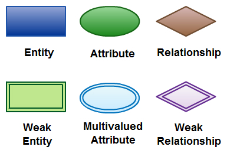

# 데이터베이스

이름: 박다인

### 1. 데이터베이스란

- 구조화된 정보 또는 데이터의 조직화된 모음
- 컴퓨터에 저장되는 데이터 집합이 쉽게 접근, 사용되기 위해 구조화된 형태로 존재함(DB는 여러 사람들이 공유하고 사용하는 목적으로 관리되는 정보**)**
- 데이터베이스 관리 시스템(DBMS)에 의해 제어됨
- 데이터와 DBMS를 하나로 묶어 데이터베이스 시스템 > 줄여서 데이터베이스

| 기술적 측면에서의 필요성 | 조직적 측면에서의 필요성 |
| --- | --- |
| 데이터 중복으로 인해 데이터 일관성 유지 어려움 | 조직이 자산으로서 데이터 관리할 필요 有 |
| 데이터 접근에 대한 관리 및 통제 필요 | 데이터의 공유 필요 |
| 데이터 파일과 프로그램간의 종속성으로 인해 비효율적임 | 데이터의 일관성 및 무결성 유지 필요 |
| 데이터가 여기저기 흩어져 있으므로 보안 유지 어려움 | 데이터의 최신성 및 유용성을 유지할 필요 有 |

| DB의 장점 | DB의 단점 |
| --- | --- |
| 데이터의 공동 이용 가능(공유) | 초기 개발 비용 ↑ |
| 데이터에 대한 접근 통제 가능(보안) | DB관리 전담 인력(DB관리자) 필요 |
| 데이터 중복 최소화 | 지속적인 유지 보수 수반되지 않으면 무용지물이 될 수 있음 |
| 데이터의 일관성 유지 가능 | 대용량 디스크로의 집중적인 Access로 인한 Overhead 발생 |
| 데이터의 물리적, 논리적 독립성 |  |
| 효율적인 유지 보수 가능 |  |

### 1-1. 데이터베이스의 특징

**독립성(Data Independence)**

- **논리적 독립성** : 응용 프로그램과 데이터베이스 간의 독립
    - 데이터의 논리적 구조를 변경시켜도 응용 프로그램의 **논리적 구조는 변경되지 않음**
- **물리적 독립성** : 응용 프로그램과 물리적 장치(ex. 보조기억장치 etc.)간의 독립
    - 데이터베이스 시스템의 성능 향상을 위한 새로운 디스크의 도입에도 응용 프로그램에 영향이 없음
    - 데이터의 **물리적 구조**만을 변경
    - 데이터베이스의 사이즈 변경 시 관련된 응용 프로그램의 수정이 필요 없음
- cf) **종속성**(Data Dependency) : 응용 프로그램의 구조가 데이터의 구조에 영향을 받음

**무결성 (Data Integrity)**

- 데이터의 삽입, 삭제, 갱신 등의 연산 후에도 데이터 베이스에 저장되어있는 데이터가 **정해진 제약조건을 항상 만족**해야 함
- 여러 경로를 통해 잘못된 데이터가 발생하는 경우를 방지하기 위한 목적
- 데이터의 유효성 검사

**일관성 (Data Consistency)**

- 데이터베이스에 저장되어있는 데이터와 특정 질의에 대한 응답이 변함 없이 일정해야 하는 조건
- 관련있는 정보를 논리적인 구조로 관리하는 체계
- 데이터 변경 시 나머지 데이터와 일치하지 않는 **불일치성의 배제**를 위한 목적

**보안성 (Data Security)**

- 데이터로의 접근 권한이 있는 사용자들만 접근할 수 있도록 설정

**중복성 (Data Redundancy)**

- 데이터의 수정, 삭제가 필요할 경우 연결되어있는 모든 데이터를 수정 및 삭제해줘야 하는 문제점 존재
- **데이터의 통합 관리**를 통해 데이터의 중복을 최소화할 것

### 2. 데이터베이스의 종류

**a. 관계형 데이터베이스(RDBMS, Relational Database Management System)**

- 2차원 구조 모델(열 : 속성, 행 : 튜플, 데이터)을 기반으로한 수평적 구조를 사용, 테이블 형식으로 데이터를 저장
- ACID(원자성, 일관성, 독립성, 지속성) 트랜잭션을 보장하는 기능을 가짐
    
    > > 데이터 무결성, 완전성, 정확성을 보장
    
- 여러 OS에서 사용 가능(Android, iOS, Solaris, Linux, Window 등)
- **예시**: MySQL, PostgreSQL, Oracle, SQL Server

**트랜잭션(Transaction)이란**

- 데이터베이스의 상태를 변환시키는 하나의 논리적 기능 (예 : Update, Delete)을 수행하기 위한 작업의 단위 혹은 일련의 연산

**ACID란**

- Atomicity(원자성) : 트랜잭션과 관련된 작업들이 부분적으로 실행되다가 중지되는 것이 아니라 하나의 원자 단위로 수행되는 것을 보장함
    
    >> 중간 단계까지 실행X, 처음부터 끝까지 완전하게 실행, 중간에서 실패하는 일이 없도록 함
    
- Consistency(일관성) : 트랜잭션이 완료되면 언제나 일관된 DB 상태를 유지하는 것을 의미
- Isolation(독립성) : 트랜잭션을 수행 할 때, 다른 트랜잭션의 연산 작업이 끼어들지 못하도록 보장하는 것.
    
    >> 다른 트랜잭션의 연산이 중간 단계의 데이터를 볼 수 없음을 의미
    
- Durability(지속성): 성공적인 트랜잭션은 영원히 반영되어야 함을 의미. 시스템 에러, DB 일관성 체크 등을 하더라도 유지되어야함. 트랜잭션은 로그에 모든 것이 저장된 후에만 Commit 상태로 간주될 수 있음.

**b. 객체 지향 데이터베이스**

- 객체지향 프로그래밍 언어의 개념(객체와 클래스, 상속 등)을 적용하여 데이터베이스를 설계
- 객체지향 프로그래밍과의 호환성이 높음
- 복잡한 데이터 구조와의 매핑이 쉬움
    - 매핑: 키(key) 역할을 하는 데이터와 값(value) 역할을 하는 데이터를 짝 지어 저장하는 데이터 구조
- **예시**: db4o, ObjectDB

- 물리적으로 떨어진 데이터베이스에 네트워크로 연결하여 단일 데이터베이스 이미지를 보여주고 분산된 작업 처리를 수행하는 데이터베이스
    - 중앙 집중형 데이터베이스: 데이터베이스 시스템 구축 시에 한 대의 물리적 시스템에 데이터베이스 관리 시스템을 설치하고 여러 명의 사용자가 데이터베이스 관리 시스템에 접속하여 데이터베이스를 사용하는 구조
- 투명성 제공: 고객은 시스템이 분산되어있는지 인식하지 못하면서 자신만의 데이터베이스를 사용하는 것 처럼 사용 가능

**d. NoSQL 데이터베이스**

- 스키마가 고정되어 있지 않아 유연하게 구조 변경 가능
- 확장성이 뛰어남
- 대용량 데이터를 빠르게 처리하는 데 유리
- **예시**: MongoDB(문서 기반), Cassandra(키-값 기반), Redis(키-값 기반), Neo4j(그래프 기반)
- 웹 애플리케이션이 보다 보편화되고 복잡해지면서 NoSQL 데이터베이스의 인기가 높아졌음

**e. 그래프 데이터베이스**

- 그래프 생성 및 조작이라는 단일 용도로 특별히 설계된 플랫폼
- 노드, 간선, 속성으로 구성
- 스키마리스: 데이터 모델에서 모든 키와 값의 데이터 타입을 정의해 둔 **스키마를** 변경하지 않고도 필요할 때 값 변경 가능
    
    >> 데이터 운영의 유연성 확보
    

### **DBMS(Database Management System, 데이터베이스 관리 시스템)란?**

- DB를 관리하는 시스템
- 데이터베이스에 데이터를 저장하고 이를 관리하여 조직에 필요한 정보를 제공해주는 시스템
- DB는 그 자체로는 어떠한 작업을 할 수 없는 그저 정보이기 때문에 다루기 위해서 **DBMS라는 소프트웨어 프로그램**이 필요
- 주요 기능
    - 정의 기능 : 데이터베이스 구조를 정의하거나 수정할 수 있다
    - 조작 기능 : 데이터를 삽입, 삭제, 수정, 검색하는 연산을 할 수 있다
    - 제어 기능 : 데이터를 항상 정확하고 안전하게 유지할 수 있다

DBMS 등장 배경

- DBMS 등장 이전: ‘파일 시스템(file system)’
    - 데이터를 파일로 관리 > 파일 생성, 삭제, 수정, 검색하는 파일 시스템 사용
    - 통합X, 프로그램마다 관리
    - 예시: 고객 관리 응용 프로그램, 주문 관리 응용프로그램이 각각 고객 데이터 파일, 주문 데이터 파일을 관리
- 파일 시스템의 문제점- 데이터 중복성
    - 같은 내용의 데이터가 여러 파일에 중복 저장됨
        
        **>> 데이터 무결성(데이터의 정확성과 일관성)**을 유지하지 못함 + 저장공간 낭비
        
- 파일 시스템의 문제점- 데이터 종속성
    - 응용 프로그램들이 각각 관리하는 데이터 파일에 종속적이었다. (딸려 붙어 있었다.)
    
    >> 사용하는 파일의 구조 변경 시 응용프로그램 수정 필요
    

### **SQL(Structured Query Language)란?**

- Query language: 특수한 응용 프로그램의 도움 없이 데이터베이스를 쉽게 이용할 수 있도록 만든 고수준 언어
- 데이터베이스에서 데이터를 추출하고 조작하는 데에 사용하는 데이터 처리 언어(데이터베이스에 저장된 정보를 쉽게 찾고 정리하는 데에 도움을 주는 도구)
- SQL을 통해 데이터베이스에서 원하는 정보를 추출 가능
- 데이터의 흐름이나 특정 조건에 따른 데이터 분석 가능
- SQL 이전: 엑셀 또는 수작업으로 데이터 분석함
    - 대량의 데이터를 분석하기에는 시간과 노력이 많이 소요됨
    - 정확성과 일관성에 영향 有

## **DBMS와 SQL 의 차이점**

### SQL과 NoSQL의 개념 및 차이점

1. RDBMS와 SQL은 어떻게 다른가요?
    - 관계형 DBMS에서 사용되는 언어
    - 인터프리터 언어
        - 소스코드를 한 줄 한 줄 읽어가며 명령을 바로 처리하는 언어.
        - 번역과 실행이 동시에 이루어짐
        - 명령 자체의 속도는 컴파일러 언어에 비해 느림
        - 고급 프로그램을 즉시 실행시킬 수 있어 프로그램 수정이 간단함
        - 예시: 자바스크립트, 파이썬, 루비, SQL
        
2. SQL과 NoSQL의 개념
    1. 두 언어의 차이점
    
    | 구분 | SQL | NoSQL |
    | --- | --- | --- |
    | 형태 | 관계형 데이터베이스 | 비관계형 데이터베이스 |
    | 쿼리 언어 | 구조화 쿼리 언어(SQL) 사용 | 특정 쿼리 언어 또는 API 사용 |
    | 스키마 | 미리 정의된 고정 스키마 | 구조화되지 않은 데이터를 위한 동적 스키마 |
    | 확장성 | 수직적 확장 가능 (서버 용량을 높임)  | 문서, 키-값, 그래프, 와이드 컬럼 스토어 등 다양한 구조 |
    | 데이터 적합성 | 다중 행 트랜잭션에 적합 | 문서나 JSON 같은 비정형 데이터에 더 적합 |
3. 각각의 언어가 어떤 상황에 사용하면 좋을까요?
    - SQL이 유리한 경우
        - 관계를 맺고 있는 데이터가 자주 변경되는 애플리케이션인 경우
            
            NoSQL에서는 여러 컬렉션을 모두 수정해야 함 > 비효율적
            
        - 변경될 여지가 없고, 명확한 스키마가 사용자와 데이터에게 중요한 경우
    - NoSQL이 유리한 경우
        - 정확한 데이터 구조를 알 수 없거나 변경, 확장될 수 있는 경우
        - 자주 읽지만, 데이터 변경은 드문 경우
        - 데이터베이스를 수평으로 확장해야 하는 경우(막대한 양의 데이터 다루는 경우)
    

### SQL의 기본 문법

1. DDL, DML, DCL 이란 무엇일까요?
    - **DDL(Data Definition Language): 데이터 정의어**
        - 데이터베이스를 정의하는 언어
        - 데이터 생성, 수정, 삭제 등의 데이터의 전체의 골격을 결정하는 언어
        - **SCHEMA, DOMAIN, TABLE, VIEW, INDEX를 정의하거나 변경 또는 삭제할 때 사용하는 언어**
        - **데이터 베이스 관리자나 데이터베이스 설계자가 사용**
        - create : 데이터베이스, 테이블 등 생성
        - alter : 테이블 수정
        - drop : 데이터베이스, 테이블 삭제
        - truncate : 테이블 초기화
    - **DML(Data Manipulation Language): 데이터 조작어**
        - 정의된 데이터베이스에 입력된 레코드를 조회, 수정, 삭제하는 언어
        - **데이터베이스 사용자가 응용 프로그램이나 질의어를 통하여 저장된 데이터를 실질적으로 처리하는데 사용하는 언어**
        - **데이터베이스 사용자와 데이터베이스 관리 시스템 간의 인터페이스를 제공**
        - select : 데이터 조회
        - insert : 데이터 삽입
        - update : 데이터 수정
        - delete : 데이터 삭제
    - **DCL(Data Control Language)**
        - 데이터베이스에 접근하거나 객체에 권한을 주는 언어
        - grant : 특정 데이터베이스 사용자에게 특정 작업에 대한 수행 권한을 부여
        - revoke : 특정 데이터베이스 사용자에게 특정 작업에 대한 수행 권한을 **박탈, 회수**
        - commit : 트랜잭션의 작업을 저장
        - rollback : 트랜잭션의 작업을 **취소, 원래대로 복구**
    

### ERD란

- Entity Relationship Diagram: 개체-관계 모델
- 테이블간의 관계를 설명해주는 다이어그램
- 이를 통해 프로젝트에서 사용되는 DB의 구조를 한눈에 파악 가능
    - 즉, API를 효율적으로 뽑아내기 위한 모델 구조도
- 정의된 기호 집합을 사용하여 Entity, Relationships 및 해당 속성의 상호 연결성을 나타냄
- 개체를 명사로, 관계를 동사로 사용하여 문법 구조 반영

- 사용법- 데이터 베이스 모델링
    - 관계형 DB에서 주로 사용
    - 엔티티의 속성을 테이블과 칼럼으로 변환 가능
    - 테이블과 관계들을 시각화할 수 있어 설계 문제점 파악 가능
- 사용법- 소프트웨어 엔지니어링
    - 소프트웨어 기획 단계에서 사용됨
    - 서로 다른 시스템 요소와 서로 간의 관계를 식별하는 데 good

- Entity: 테이블을 구성하는 객체 구성성분
    - 구성 관계: ERD > Entity > Entity attribute
    - 논리적인 관계를 시각적으로 쉽게 구분하기 위해 기호 사용
    - 어떤 시스템인지에 따라 Entity는 사람, 장소, 사건(이벤트), 오브젝트가 될 수도 있음
- Weak Entity
    - 존재하는 다른 entity에 의존적인 entity
- Attribute
    - 특성, entity의 성격, 관계 또다른 속성
- Multivalued Attribute
    - 한 값 이상의 값을 가진 attribute
- Derived Attribute
    - 다른 속성에 기초한 속성

- One
    - 일대일 혹은 일대다 관계
    - 주로 하나의 외래 키가 걸린 관계.
- Many
    - 다대다 관계
    - 중계 테이블을 통하여 여러 개의 데이터를 바라보고 있을 때 사용
- One (and only one)
    - 위의 조건과 동일하게 일대일 관계이나, 하나의 row 끼리만 연결된 데이터
- Zero or one
    - 일대일 혹은 일대다 관계를 가지고 있으나, 필수 조건이 아님을 의미
- One or many
    - 일대일 혹은 다대다 관계를 가지고 있음
    - 관계를 가지고 있으나, 참조되는 row 값들이 불명확함
- Zero or many참조하는 테이블과의 관계가 불명확한 경우
    - 장바구니처럼 row 생성값이 없을수도, 하나일수도, 여러개일 수도 있는 경우

