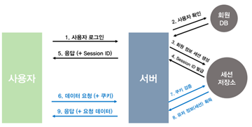
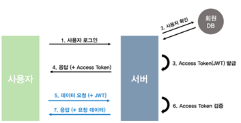

### 쿠키와 세션은 무엇인가?

- HTTP 프로토콜에서 쿠키와 세션을 사용하게 된 이유가 무엇일까요?
- 쿠키는 무엇일까요?
	: 사이트에서 사용하고 있는 서버에서 사용자의 컴퓨터에 저장하는 작은 정보 파일
	: 주로 세션 식별자 (세션 id)와 같은 정보를 저장, 사용자 맞춤 데이터를 보관
- 세션이란 무엇일까요?
	: 일정 시간 (서버 접속~연결 끝)동안 같은 사용자로부터 들어오는 요구를 하나의 상태로 보고 그 상태를 유지시키는 기술
	서버에서 관리되므로 상대적으로 보안이 강함
- 쿠키와 세션의 관계는 어떻게 될까요? 전송 흐름에 맞춰 생각해보세요!
	: 서로를 보완하는 구조로써 쿠키는 클라이언트에 데이터를 저장해 보안에 취약할 수 있지만 세션은 서버에서 관리하기에 보안에 강하다
	: 쿠키를 사용해 세션을 관리하여 쿠키의 단점을 보완한다.

- 그렇다면, 쿠키와 세션의 차이점은 어떤 게 존재할까요?

- 쿠키
 cilent에 저장
 속도 : 빠름
- 세션
 server에 저장
 느림

### 세션 기반 인증 과 토큰 기반 인증

- 세션 기반 인증의 흐름 방식
	: 세션기반 인증은 오랫동안 사용자 인증을 처리하는 기본 방법
	: 세션이 서버와 클라이언트 양쪽에서 유지되어야 한다.
장점
	: 위변조, 손상우려가 없다
단점 
	: 사용자가 늘어나면 서버를 확장하거나 DB에 무리가 갈 수 있음.

1) 클라이언트는 서버 접속 시 세션ID를 발급받는다.
(서버는 세션 ID를 하나 생성하여 쿠키 값으로 만들고 Set Cookie 라는 헤더를 통해서 클라이언트에 전송)
2) 클라이언트는 발급받은 세션ID를 쿠키로 저장하고,
3) 이후 서버에 요청할 때, 쿠키에 저장된 세션ID를 전달한다.
4) 서버에서는 전달받은 세션ID로 DB에서 클라이언트 정보를 가져와서 처리 후 응답한다

- 토큰 기반 인증의 흐름 방식
	: 토큰을 사용한 인증을 말할 때, JSON 웹 JWT를 의미한다.
	: 상태를 유지하지 않아도 된다.
	: 서버는 토큰을 받아 요청의 진위 여부를 확인한다.

1) 무상태성
2) 확장성
3) 분리 가능성

 단점 : 한 번 발급된 토큰은 임의로 만료시킬 수 없기에 해커에게 탈취되었다면 토큰 만료까지 계속 공격받을 수 있다.

1) 서버는 아이디,비밀번호 등으로 검증을 완료한 사용자에게 토큰을 발급한다.
2) 클라이언트는 토큰을 저장한 후, 서버에 요청(Request)할 때 헤더에 토큰을 함께 보낸다.
3) 서버는 해당 JWT의 유효성을 검사하고 인가한다

- 각 인증 방식에서 헤더 작성 방식
찾아봤는데 잘모르겠어서 조사를 못했습니다..

- 클라이언트에서 토큰은 어떻게 관리가 될까요?
 Local Storage : 브라우저의 로컬 저장소에 토큰을 저장
장점 : 사용이 간단하고 직관적 , 세션 간 데이터를 유지 가능.
단점 : XSS(Cross-Site Scripting) 공격에 취약: 악의적인 스크립트가 로컬 저장소를 읽을 수 있음

토큰 기반 인증과 세션 기반 인증은 어떠한 경우에 사용할지 생각해보세요!

토큰 기반 인증
1) 분산 시스템
서버 간 상태를 공유하지 않으므로 마이크로서비스 환경에 적합.
2) 다중 플랫폼 애플리케이션
웹, 모바일, 데스크톱 등 다양한 클라이언트가 있는 경우.

세션 기반 인증
1) 소규모 웹 애플리케이션
서버 부하가 적고 단일 서버로 동작하는 경우.
2) 브라우저 중심 서비스
전통적인 웹 애플리케이션이나 간단한 인증이 필요한 웹사이트.
3) 보안이 중요한 시스템
은행, 금융 시스템 등 세션 데이터를 서버에서 철저히 관리해야 하는 경우.

- 캐시(Cache)의 의미
 자주 사용되거나 접근 시간이 중요한 데이터를 임시로 저장해 두는 고속 데이터 저장소

- 장점
 데이터 접근 속도 향상
 시스템 리소스 절약
 운영 비용 절감