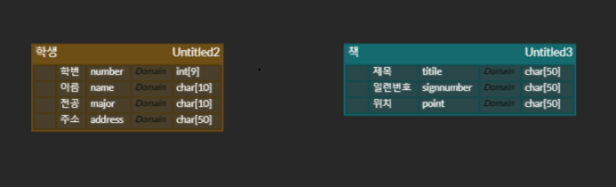

# 앱센터 데이터베이스

추가 일시: 2024년 10월 26일 오후 4:03
강의: 앱센터_Basic_study

# Data Base

## 데이터베이스란 무엇이고 어떤 종류가 있나요?

---

- 데이터베이스는 고조화된 정보 또는 데이터의 조직화된 모음으로서 일반적으로 컴퓨터 시스템에 전자적으로 저장됩니다.

- 데이터베이스는 일반적으로 데이터베이스 관리 시스템(DBMS)에 의해 제어됩니다.

- 연결된 어플리케이션과 함께 에디터와 DBMS를 하나로 묶어 데이터베이스 시스템이라고 하며 단축하여 데이터베이스라고도 합니다.

### 1-(a). 데이터베이스에는 무슨 종류가 있나요?

- 관계형 데이터베이스
    - 관계형 데이터베이스의 항목은 열과 행이 있는 테이블 집합으로 구성됩니다.

- 객체 지향 데이터베이스
    - 객체 형태로 표현됩니다.
    
- 분산 데이터베이스
    - 서로 다른 사이트에 위치한 둘 이상의 파일로 구성됩니다. 데이터베이스는 물리적으로 동일한 위치에 있는 여러 컴퓨터에 저장되거나 다른 네트워크에 분산될 수 있습니다.

- 데이터 웨어하우스
    - 빠른 쿼리 및 분석을 위해 특별히 설계된 데이터베이스 유형입니다.

- NoSQL 데이터베이스
    - NoSQL 또는 비관계형 데이터베이스를 사용하면 비정형 및 반정형 데이터를 저장하고 조작할 수 있습니다.

- 그래프 데이터베이스
    - 그래프 데이터베이스는 엔티티 및 엔티티 간의 관계 측면에서 데이터를 저장합니다.

### 1-(b). 데이터베이스의 특징은 무엇일까요?

- Real-Time Accessibility (실시간 접근성)
    - 비정형적인 조회에 대하여 실시간 처리에 의한 응답이 가능해야 한다.
    
- Continuous Evolution (계속적인 변화)
    - 데이터베이스의 상태는 동적이다. 데이터의 삽입, 삭제, 갱신으로 항상 최신 데이터를 유지해야 한다.

- Concurrent Sharing (동시 공용)
    - 데이터베이스는 서로 다른 목적을 가진 여러 응용자를 위한 것으로 다수의 사용자가 동시에 같은 내용의 데이터를 이용할 수 있어야 한다.

- Content Reference (내용에 의한 참조)
    - 데이터베이스에 있는 데이터를 참조할 때 데이터 레코드의 주소나 위치에 의해서가 아니라 사용자가 요구하는 데이터 내용으로 찾아야 한다.

## 그렇다면 DBMS는 무엇인가요?

---

- 데이터 베이스에는 일반적으로 **데이터베이스 관리 시스템(DBMS)**으로 알려진 포괄적인 데이터베이스 소프트웨어 프로그램이 필요합니다.

- DBMS는 데이터베이스와 최종 사용자 또는 프로그램 간의 인터페이스 역할을 하여 사용자가 정보의 구성 및 최적화 방법을 검색, 업데이트 및 관리할 수 있게 해줍니다.

- 또한 DBMS는 데이터베이스의 감독 및 제어가 용이하여 성능 모니터링, 튜닝, 백업, 복구 같은 다양한 관리작업이 가능합니다.

- MySQL, Microsoft Access, Microsoft SQL Sever, FileMaker Pro, Oracle Database 등이 있습니다.

## SQL과 NoSQL의 개념 및 차이점

---

### RDBMS와 SQL은 어떻게 다른가요?

- RDBMS (Relational Database Management System)
    - 관계형 모텔을 기반으로 데이터베이스를 관리하는 시스템이다.

- SQL
    - RDBMS와 소통하는 프로그래밍 언어
    - 데이터베이스를 상대로 데이터를 조회, 입력, 수정, 삭제하기 위해 질의(query)한다.

### SQL과 NoSQL의 개념

- SQL 데이터베이스는 관계형, NoSQL 데이터베이스는 비관계형 데이터베이스입니다.

- SQL 데이터베이스는 구조화 쿼리 언어(SQL)를 사용하며 미리 정의된 스키마가 있습니다.

- NoSQL 데이터베이스에는 구조화되지 않은 데이터를 위한 동적 스키마가 있습니다.

- SQL 데이터베이스는 테이블 기반인 반면, NoSQL 데이터베이스는 문서, 키-값, 그래프 기반입니다.

- SQL 데이터베이스는 다중 행에 더 적합한 반면, NoSQL은 문서나 JSON과 같은 비정형 데이터에 더 적합합니다.

## SQL의 기본 문법

---

### DDL(Data Definition Language) : 데이터 정의어

- CREATE : 객체 생성
- DROP : 객체 삭제
- ALTER : 객체 변경
- TRUNCATE TABLE : 테이블에 있는 모든 데이터 삭제
- RENAME : 객체 이름 변경

### DML(Data Manipulation Language) : 데이터 조작어

- SELECT : 테이블이나 뷰에서 데이터 조회
- INSERT : 데이터 입력
- UPDATE : 기존 데이터를 수정
- DELETE : 테이블에 있는 데이터 삭제
- MERGE : 조건에 따라 INSERT, UPDATE 수행

### DCL(Data Control Language) : 데이터 제어어

- GRANT : 객체에 대한 권한을 할당
- REVOKE : 객체에 할당된 관한 회수

### Transaction

- 더이상 분할이 불가능한 업무처리의 단위
- 한꺼번에 수행되어야 할 일련의 연산모음

- 어떠한 상황에 활용되나요?
    - 같이 이루어져야하는 업무의 경우
    - ‘입금’ 을 수행하는 명령어와 ‘출금’ 을 수행하는 명령어를 가정했을 때
    - A통장에서 B통장으로 송금하면 A통장에서 출금과 B통장에서 입금이 동작해야한다.

## ERD는 무엇인가요?

---

### ERD란?

Entity Relationship Diagram의 약자

데이터베이스 설계 과정에서 사용되는 모델링 기법 중 하나

데이터베이스에 저장될 데이터 엔티티들과 엔티티 간의 관계를 시각적으로 표현한 것.

one and many

(선 그리는 법을 모르겠음;;) 

—||—————{ 

one and many 표시

요런거 그려야함